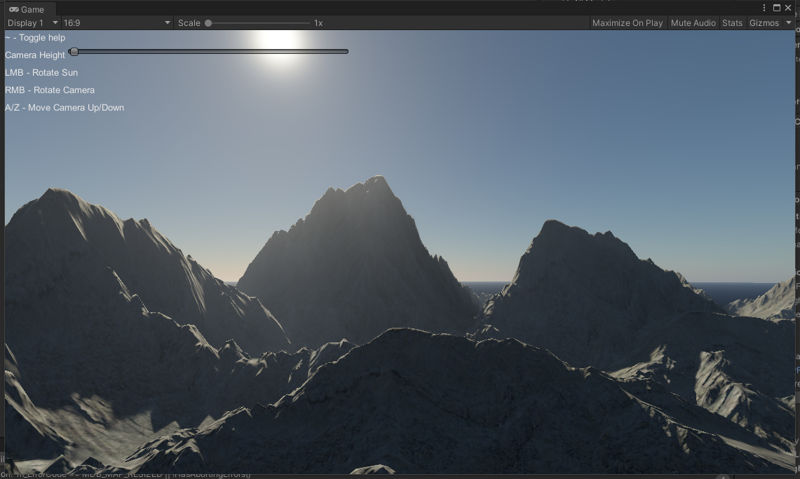
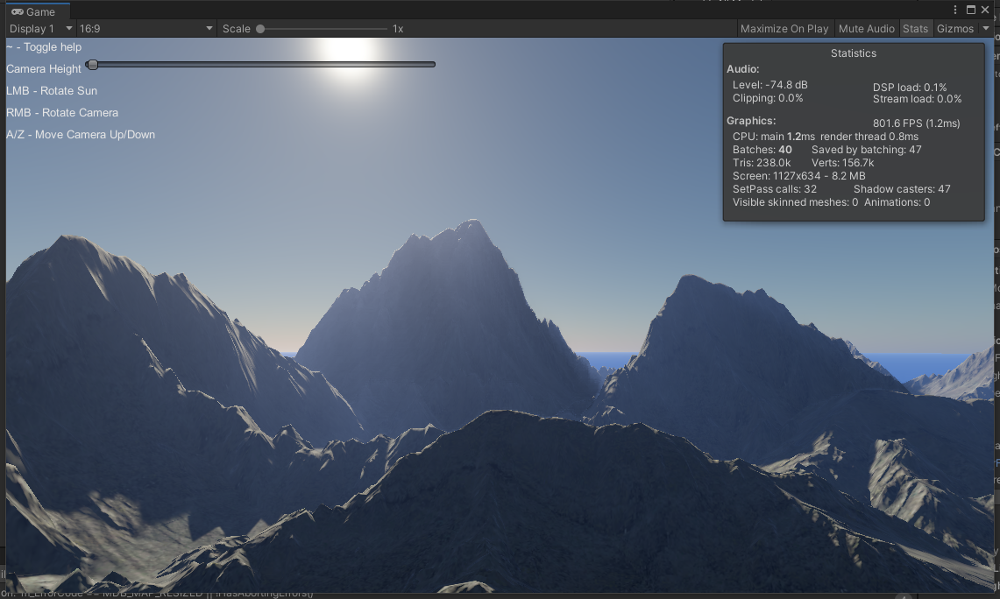
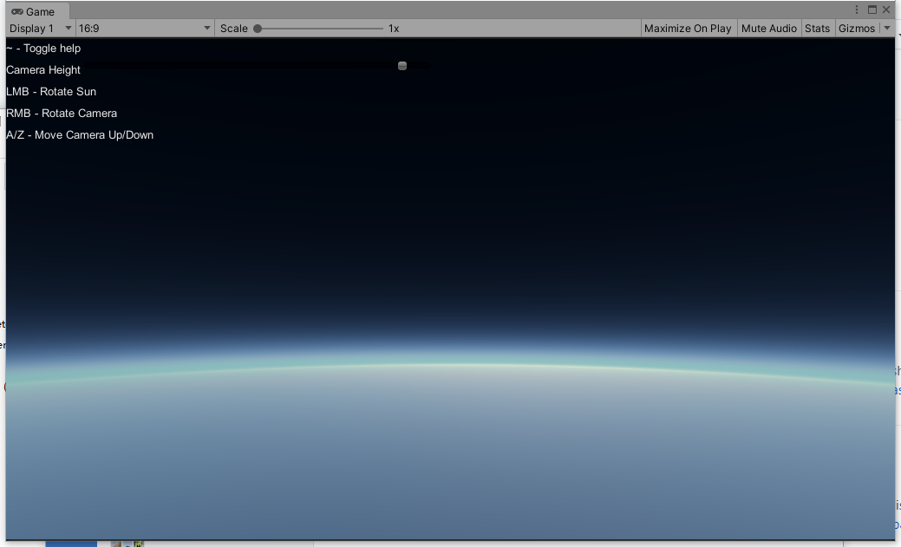
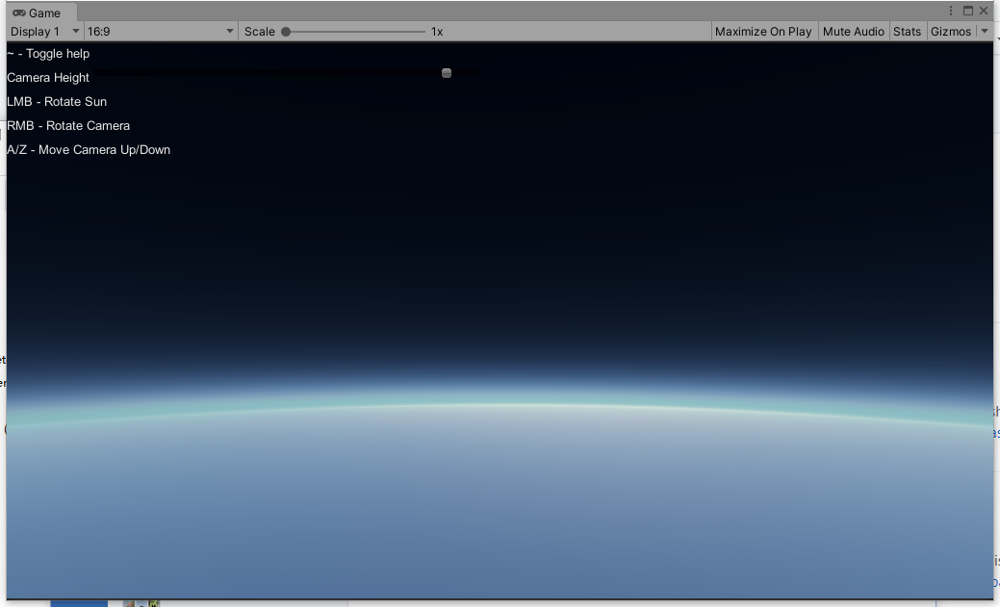

# MultiScatteringAtmosphere

Forked from SlightlyMad/AtmosphericScattering 

Render the atmosphere using approximate multiple scattering methods (MultiScattLUT)

Reference：

sebh/UnrealEngineSkyAtmosphere

MultiScatterFactor = 0

MultiScatterFactor = 25

MultiScatterFactor = 0

MultiScatterFactor = 30

